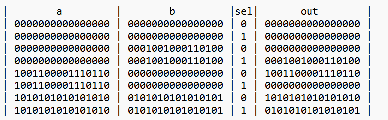

#  MUX16
## Overview
Mux16.hdl is a hardware description file for the Mux16 chip. Mux16 is a fundamental logic gate that takes two 16-bit inputs and selects one based on a control signal. It implements the following truth table.

### Truth Table

