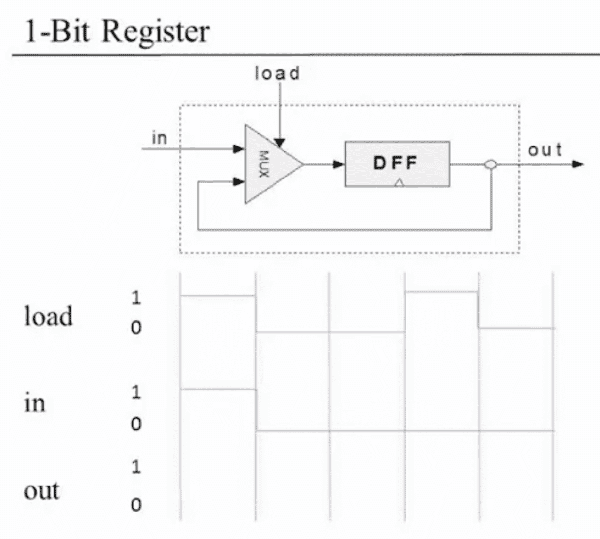

# Bit.hdl
Bit.hdl is  a hdl implementation of 1-bit register. 

## Overview 

Bit.hdl is a sequential logic circuit. It takes one bit input and based on the load bit it returns correspond output.

**if Load==o**

the circuit returns its current state.

**if Load==1**

then from the next cycle the circuit will returns its current input onward.

