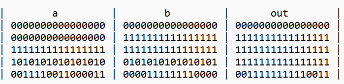

# Or16

## Overview
Or.hdl is a hardware description file for Or16 chip.The Or16 chip is a 16-bit bitwise Or gate. It takes a 16-bit input and performs Or operation, producing a 16-bit output.This chip implements following truth table.

### Truth Table
    
